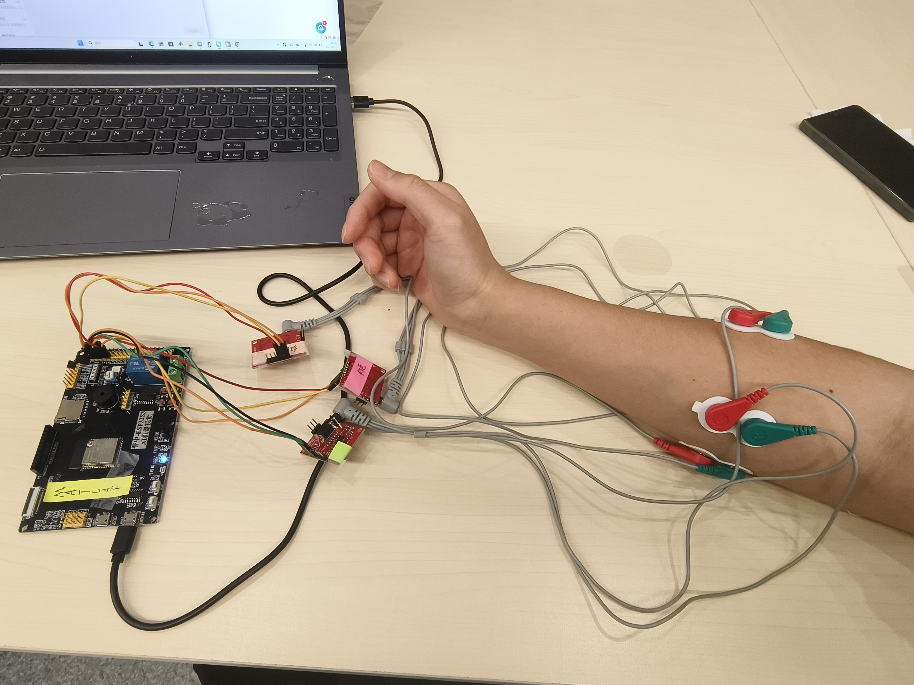
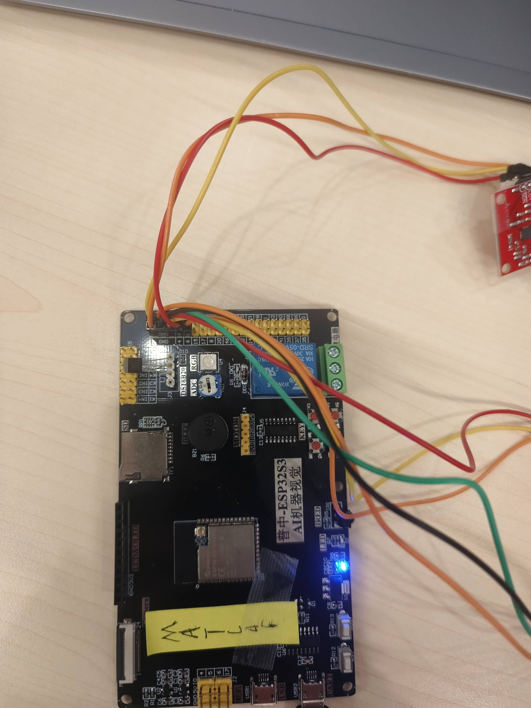
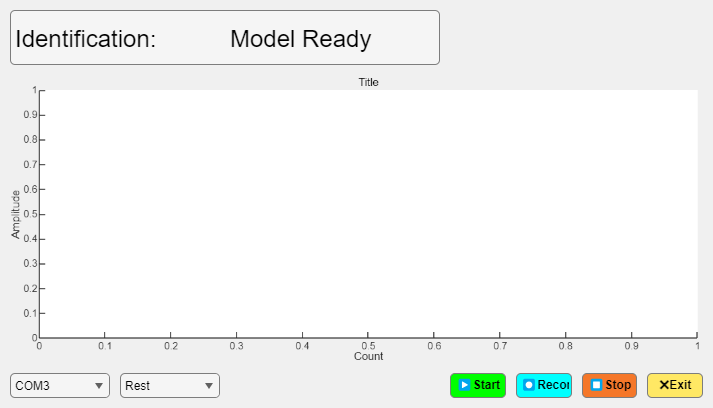

# Real-Time Three-Channel sEMG Gesture Recognition System

A BME3201 course research project that acquires three channels of surface electromyography (sEMG) at 1 kHz with an ESP32-S3, records and visualizes the signals in MATLAB or a browser, and recognizes four hand states with a linear ECOC-SVM.

> 三通道实时表面肌电采集与手势识别原型。README 重点说明硬件接线、串口与 Wi-Fi 部署、MATLAB 训练和实时识别流程。

  

## What the prototype includes

- Three analog acquisition channels on ESP32-S3 GPIO 4, 5, and 6
- 1 kHz sampling over either 921600-baud USB serial or Wi-Fi/WebSocket
- MATLAB App Designer interface for live plotting, labeled recording, filtering, and four-class recognition
- Offline MATLAB pipeline using MAV, WL, ZC, and SSC features with a linear one-vs-one ECOC-SVM
- Browser client for three-channel plotting and CSV recording
- 65 included three-channel recordings, the saved MATLAB model, presentation, and two demonstration videos

Supported labels: **Rest**, **Fist**, **Grasp**, and **Scissor**.

## System architecture

~~~mermaid
flowchart LR
    E[Surface electrodes] --> S[3 analog sensor modules]
    S --> M[ESP32-S3 ADC GPIO 4, 5, 6 @ 1 kHz]
    M -->|USB serial 10-byte frames| A[MATLAB App]
    M -->|Wi-Fi AP + WebSocket 25-sample batches| W[Browser client]
    A --> D[Labeled MAT recordings]
    D --> P[Filtering + 200 ms windows]
    P --> F[12 features MAV, WL, ZC, SSC]
    F --> C[Linear ECOC-SVM]
    C --> A
~~~

The serial and Wi-Fi sketches are alternative firmware builds. Flash one at a time according to the host application you want to use.

## Hardware deployment

### Safety boundary

This repository describes a teaching and research prototype, **not a medical device**. Use battery-powered or medically isolated acquisition hardware when electrodes are attached to a person. Do not connect a participant to an exposed, non-isolated mains-powered circuit. Stop immediately if the participant feels pain, heat, tingling, or skin irritation. Follow the sensor manufacturer's electrode and isolation instructions and your institution's human-participant rules.

### Hardware used in the course prototype

| Item | Quantity | Purpose |
| --- | ---: | --- |
| ESP32-S3 development board | 1 | ADC sampling and serial/Wi-Fi transport |
| Analog ECG/EMG front-end module | 3 | One analog output per forearm channel |
| Surface electrodes and leads | 3 sets | Differential measurement and reference connections |
| USB data cable | 1 | Power, flashing, and serial communication |
| Computer or mobile device | 1 | MATLAB desktop or browser client |

The supplied photographs document the course hardware but do not identify an exact commercial sensor model. Check the voltage range and pinout printed on your own modules before wiring them.

  
  

### Signal wiring

| Signal | ESP32-S3 pin | Firmware constant |
| --- | ---: | --- |
| Channel 1 analog output | GPIO 4 | PIN_SIGNAL_1 / PIN_CH1 |
| Channel 2 analog output | GPIO 5 | PIN_SIGNAL_2 / PIN_CH2 |
| Channel 3 analog output | GPIO 6 | PIN_SIGNAL_3 / PIN_CH3 |
| Sensor ground | GND | Common low-voltage reference |
| Sensor supply | Module-specific | Confirm before connection |

Do not assume every ESP32-S3 board exposes the same ADC-capable pins. Confirm the pin map for your board revision. Keep analog leads short, provide strain relief, and route them away from USB and radio antennas when possible.

### Electrode placement

The demonstration used three electrode sets distributed over the forearm to capture different muscle activation patterns. For each front-end module:

1. Clean and dry the skin according to your laboratory protocol.
2. Place the two measurement electrodes over the selected muscle region and keep their spacing and orientation consistent across recordings.
3. Attach the module reference electrode as required by its manufacturer.
4. Photograph or record the placement so training and deployment sessions use the same locations.
5. Verify a stable resting baseline before recording labeled gestures.

The repository does not contain a validated anatomical placement protocol. The photograph is a record of the course demonstration, not clinical guidance.

### Option A: USB serial deployment

Use [firmware/serial/serial_tx_bin.ino](firmware/serial/serial_tx_bin.ino) with the MATLAB App.

1. Install Arduino IDE or Arduino CLI with ESP32-S3 board support.
2. Select the matching ESP32-S3 board and flash the serial sketch.
3. Connect the three sensor outputs to GPIO 4, 5, and 6.
4. Connect the board to the computer over USB and identify its COM port.
5. In MATLAB, change to the [matlab](matlab) directory and open [EMG_recognition.mlapp](matlab/EMG_recognition.mlapp).
6. Select the COM port, click **Start**, and verify three separated traces before recording or recognizing gestures.

Serial settings implemented by the firmware and App:

| Parameter | Value |
| --- | --- |
| Baud rate | 921600 |
| Sampling interval | 1000 us |
| Nominal sampling rate | 1 kHz |
| Byte order | Little-endian on ESP32-S3 |
| Frame length | 10 bytes |

Serial frame layout:

| Offset | Size | Field |
| ---: | ---: | --- |
| 0 | 1 byte | Carriage return, decimal 13 |
| 1 | 1 byte | Line feed, decimal 10 |
| 2 | 2 bytes | Rolling counter |
| 4 | 2 bytes | Channel 1 ADC value |
| 6 | 2 bytes | Channel 2 ADC value |
| 8 | 2 bytes | Channel 3 ADC value |

### Option B: Wi-Fi/WebSocket deployment

Use [firmware/wifi/wifi_emg.ino](firmware/wifi/wifi_emg.ino) with [web/index.html](web/index.html).

The sketch requires the ESP32 Arduino core and the arduinoWebSockets library that provides WebSocketsServer.h.

1. Change the demonstration SSID and password in the firmware before deployment.
2. Flash the Wi-Fi sketch and open the serial monitor at 115200 baud to read the access-point address.
3. Connect the computer or mobile device to the ESP32 access point.
4. Serve the repository's browser client locally, for example:

   ~~~powershell
   python -m http.server 8000 --directory web
   ~~~

5. Open http://localhost:8000, retain ws://192.168.4.1:81 when the ESP32 uses its default AP address, and click **连接**.

The firmware only provides a WebSocket server; it does not host the HTML page. The page loads Tailwind CSS from a CDN, so its styling may be unavailable when the ESP32 access point has no Internet route. Signal reception and CSV logic are local JavaScript.

Wi-Fi transport settings:

| Parameter | Value |
| --- | --- |
| AP SSID in the supplied sketch | ESP32-EMG-Host |
| AP password in the supplied sketch | 12345678 (change before use) |
| WebSocket port | 81 |
| Nominal sampling rate | 1 kHz |
| Samples per WebSocket message | 25 |
| Bytes per sample | 8 |
| Message payload | 200 bytes |

Each packed Wi-Fi sample contains four little-endian uint16 fields: counter, channel 1, channel 2, and channel 3. The browser validates that every received message length is divisible by eight.

## MATLAB workflow

### Requirements

- MATLAB R2024b was used to save the included App Designer file; its metadata declares R2018a as the minimum supported release.
- Signal Processing Toolbox for butter, filter, filtfilt, and designfilt.
- Statistics and Machine Learning Toolbox for cvpartition, templateSVM, and fitcecoc.

### Train the model

From MATLAB:

~~~matlab
run('matlab/Train_EMG_Model.m')
~~~

The script resolves paths from its own location, reads all data/raw MAT recordings, displays evaluation figures, and writes matlab/MyTrainedModel.mat.

Training configuration implemented in the script:

| Stage | Configuration |
| --- | --- |
| Notch filter | Second-order IIR band stop, 49-51 Hz |
| Passband construction | Fourth-order 20 Hz high-pass, then 450 Hz low-pass |
| Window | 200 samples / 200 ms |
| Stride | 50 samples / 50 ms |
| Features per channel | MAV, WL, ZC, SSC |
| Total features | 12 for three channels |
| ZC/SSC threshold | 0.005 in the script's input units |
| Classifier | Standardized linear SVM learners in one-vs-one ECOC |
| Evaluation | Random 80/20 holdout over extracted windows |

### Run live recognition

Keep the App, getEMGFeatures.m, and MyTrainedModel.mat in the same MATLAB folder. Open the App, select the serial port, and click **Start**. The App:

- parses the 10-byte serial frames;
- displays filtered three-channel waveforms;
- records raw ADC values into labeled MAT files;
- predicts every 50 new samples from the latest 200-sample window; and
- shows Rest, Fist, Grasp, or Scissor in the interface.

  

## Browser client

The browser client can connect to the Wi-Fi firmware, display three raw ADC channels, pause plotting, and save received samples as CSV with the columns Time,Count,CH1,CH2,CH3.

It also contains a JSON-model inference path, but this repository does not include a MATLAB-to-JSON exporter or a compatible JSON model. Browser recognition should therefore be treated as experimental. Waveform display and CSV recording do not require a model file.

## Included dataset

All 65 recordings under [data/raw](data/raw) were checked with MATLAB: every file contains one two-dimensional variable with exactly three columns.

| Label | Files | Samples | Duration at 1 kHz |
| --- | ---: | ---: | ---: |
| Rest | 20 | 102,532 | 102.532 s |
| Fist | 15 | 72,614 | 72.614 s |
| Grasp | 15 | 69,346 | 69.346 s |
| Scissor | 15 | 78,884 | 78.884 s |
| **Total** | **65** | **323,376** | **323.376 s** |

File names follow data_Label_HHMMSS.mat. The App records raw ADC values; it does not convert them to volts before saving. Preserve channel order, electrode placement, sampling rate, and hardware gain when collecting compatible data.

## Reported result and evaluation boundary

The course presentation reports **95.1% test accuracy**. This value comes from the current script's random window-level 80/20 holdout, not from a held-out person or an independent recording session.

The 200 ms windows overlap by 150 ms. Because the script creates all windows before random partitioning, adjacent windows from the same recording can appear in both training and test sets. The reported result may therefore be optimistic. The script also does not set a random seed, so reruns can produce different values.

Do not interpret 95.1% as subject-independent, record-independent, clinical, or real-world deployment performance. A stronger study should split by participant or recording before window generation and report per-class sensitivity, specificity, F1, confusion matrices, and repeated or cross-validated results.

Additional implementation differences affect reproducibility:

- offline training uses zero-phase notch filtering but causal high/low filtering;
- MATLAB live inference uses zero-phase filtering for all three filters;
- browser features are mean-centered and voltage-scaled but do not reproduce the MATLAB filtering pipeline; and
- the training-data comment describes a voltage threshold although saved App data are raw ADC values.

These differences are preserved to keep the supplied implementation unchanged and are documented here for future correction and controlled ablation.

## Repository layout

~~~text
firmware/serial/       ESP32-S3 USB serial acquisition
firmware/wifi/         ESP32-S3 AP and WebSocket acquisition
matlab/                App Designer, training, features, saved model
web/                   Browser waveform and CSV client
data/raw/              Included three-channel labeled recordings
docs/images/           Hardware and App images used in this README
docs/media/            MATLAB and mobile/browser demonstration videos
docs/presentation/     Original BME3201 presentation
~~~

## Project artifacts

- [MATLAB desktop demonstration](docs/media/matlab-desktop-demo.mp4)
- [Web/mobile demonstration](docs/media/web-mobile-demo.mp4)
- [BME3201 project presentation](docs/presentation/EMG.pptx)

Large binary artifacts use Git LFS. Install Git LFS before cloning if you need the actual MAT, MLAPP, MP4, and PPTX contents rather than pointer files.

## Team

Developed for the BME3201 course project at The Chinese University of Hong Kong, Shenzhen, September-December 2025.

- Project lead: Haoxin Li
- Team members: Guqi Zhang, Yibo Wang, Xiaoxiang Liang
- Advisor: Dr. Shixiong Chen

## License

Original source code is available under the [MIT License](LICENSE). The recordings, trained model, presentation, images, and videos are governed separately by [DATA_LICENSE.md](DATA_LICENSE.md).
